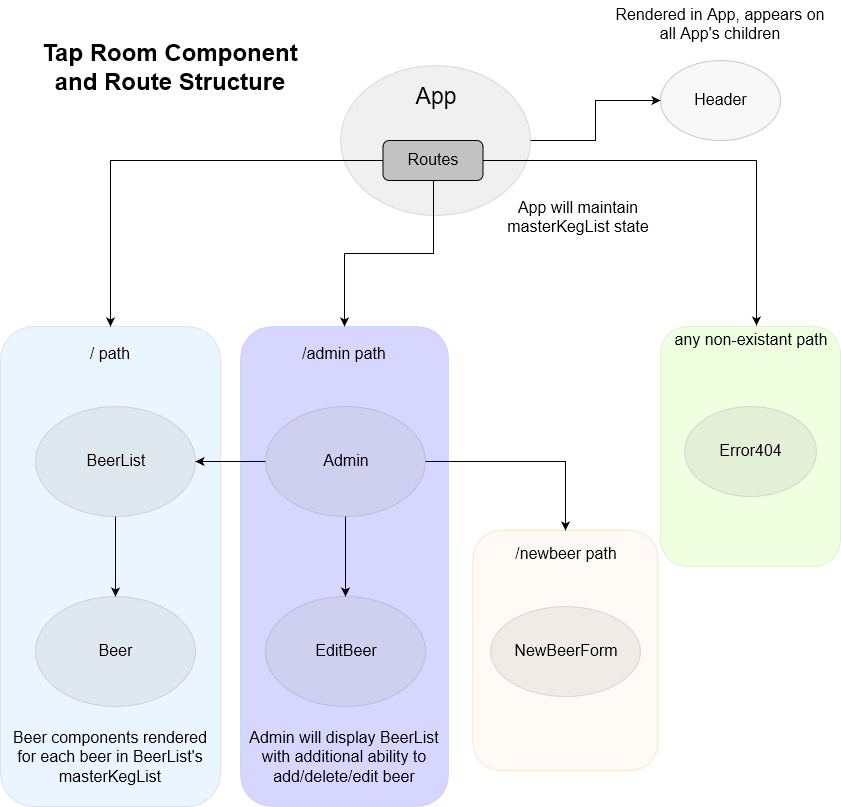

# TapRoom - React

#### A beer keg application.

#### By _Lan Dam, 09.07.2018_

## Description

Tap Room is an application that allows a user to view a list of beer and add and edit its contents.
This is a React version of the TapRoom web application previously built with Angular.
There is a lot of similarities between the two way of coding, since both break it down into multiple smaller components.
Angular's components are base on the objects and how to interact with them.
React's components are base on the functions, with each component fulfilling one specific functionality.

## Setup

  * Clone or download repository
  * npm install
  * npm run start

## Technologies Used

  **React, HTML, CSS**

## Support and Contact

For any questions or support details, please email:
  * ldam77@yahoo.com  

## Specification

* As a patron, I want to see a list/menu of all available kegs. For each keg, I need to see its name, brand, price and alcoholContent (or perhaps something like flavor for a kombucha store).

* As an employee, I want to fill out a form when I tap a new keg to add it to the list. (Don't worry about authenticating employee user accounts yet.)
As an employee, I want the option to edit a keg's properties after entering them just in case I make a mistake.

* As a patron and/or employee, I want to see how many pints are left in a keg. (Hint: A full keg has roughly 124 pints).

* As an employee, I want to be able to click a button next to a keg whenever I sell a pint of it. This should decrease the number of pints left by 1.

* As an employee, I want to be able to see kegs with less than 10 pints left so I can be ready to change them.

* As a patron, I want to have kegs prices to be color-coded for easy readability. Perhaps based on their price (greater or less than $5 per pint, perhaps) or the particular style of beer or kombucha.

* As a patron, I want to use the alcohol content property to display stronger beers differently than weaker beers.

## Notes

* Component Route and Structure drawing is preliminary based on the limited functionality.  Will be updated once all functionalities are added next week.
* Don't know how to edit and save properties data yet. This include adding new keg to list. Hopefully complete this spec next week
* Not sure if button to sell a pint need to be a separate component.  Will be complete next week with the edit functionality

## Component Route and Structure

### License

*This software is licensed under the MIT license.*

Copyright (c) 2018 **Lan Dam**
